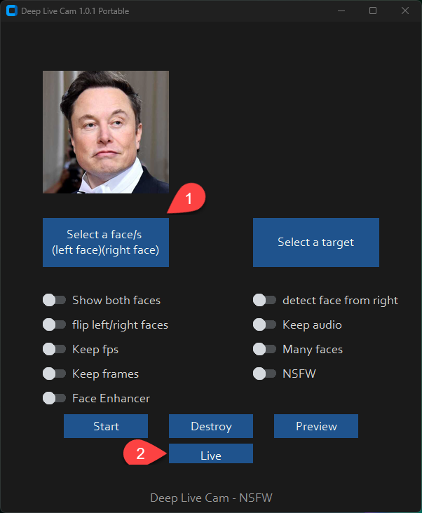

**免责声明**

**这个分支经过 NITSC 的修改，只经过我们（NITSC）的电脑验证，没有经过大众验证。**
这款软件旨在为蓬勃发展的AI生成媒体行业做出积极贡献，帮助艺术家完成动画自定义角色、使用角色作为服装模型等任务。
开发人员意识到该软件可能存在不道德的应用，并承诺采取预防措施。它内置了检查功能，防止程序在包括裸露、图形内容、战争画面等在内的不适当媒体上运行。我们将继续积极开发该项目，并遵守法律和道德规范。如果法律要求，该项目可能会关闭或在输出中包含水印。
用户应负责任地使用该软件，并遵守当地法律。如果使用真实人物的面孔，建议用户从相关人员那里获得许可，并在在线发布内容时明确说明这是深度伪造视频。该软件的开发人员不承担最终用户行为的责任。

**如何安装**？
### 基本安装 (CPU)
1. **设置平台**:
    - python (推荐使用 3.10)
    - pip
    - git
    - [ffmpeg](https://www.youtube.com/watch?v=OlNWCpFdVMA) 
    - [visual studio 2022 runtimes (windows)](https://visualstudio.microsoft.com/visual-cpp-build-tools/)
2. **克隆仓库**:
    ```
    https://github.com/hacksider/Deep-Live-Cam.git
    ```
3. **下载模型**:
    1. [GFPGANv1.4](https://huggingface.co/hacksider/deep-live-cam/resolve/main/GFPGANv1.4.pth)
    2. [inswapper_128_fp16.onnx](https://huggingface.co/hacksider/deep-live-cam/resolve/main/inswapper_128_fp16.onnx)
    然后将这两个文件放在“**models**”文件夹中。
4. **安装依赖项**:
    我们强烈建议使用 `venv` 以避免问题。
   
    (适用于 Python3.12.x)
    ```
    pip install -r requirements.txt
    ```
    (适用于 Python3.10.x)
    ```
    pip install -r orginal_requirements.txt
    ```
    完成 !!! 如果您没有 GPU，您应该能够使用 `python run.py` 命令运行 roop。请注意，在首次运行程序时，它将下载一些模型，这可能会根据您的网络连接花费一些时间。
### GPU 加速
#### CUDA 执行提供程序 (Nvidia)
1.  安装 [CUDA Toolkit 11.8](https://developer.nvidia.com/cuda-11-8-0-download-archive)
    
2.  安装依赖项:
    ```
    pip uninstall onnxruntime onnxruntime-gpu
    pip install onnxruntime-gpu==1.16.3
    ```
3.  如果提供程序可用，则使用:
    ```
    python run.py --execution-provider cuda
    ```
#### CoreML 执行提供程序 (Apple Silicon)
1.  安装依赖项:
    ```
    pip uninstall onnxruntime onnxruntime-silicon
    pip install onnxruntime-silicon==1.13.1
    ```
2.  如果提供程序可用，则使用:
    ```
    python run.py --execution-provider coreml
    ```
#### CoreML 执行提供程序 (Apple Legacy)
1.  安装依赖项:
    ```
    pip uninstall onnxruntime onnxruntime-coreml
    pip install onnxruntime-coreml==1.13.1
    ```
2.  如果提供程序可用，则使用:
    ```
    python run.py --execution-provider coreml
    ```
#### DirectML 执行提供程序 (Windows)
1.  安装依赖项:
    ```
    pip uninstall onnxruntime onnxruntime-directml
    pip install onnxruntime-directml==1.15.1
    ```
2.  如果提供程序可用，则使用:
    ```
    python run.py --execution-provider directml
    ```
#### OpenVINO™ 执行提供程序 (Intel)
1.  安装依赖项:
    ```
    pip uninstall onnxruntime onnxruntime-openvino
    pip install onnxruntime-openvino==1.15.0
    ```
2.  如果提供程序可用，则使用:
    ```
    python run.py --execution-provider openvino
    ```
**如何使用**？
> 注意：首次运行此程序时，它将下载一些模型，大小约为 300MB。
执行 `python run.py` 命令将启动以下窗口：

选择一个面部 (包含所需面部的图像) 和目标图像/视频 (您想要替换面部的图像/视频)，然后单击“开始”。打开文件资源管理器，导航到您选择的输出目录。您将找到名为 `<video_title>` 的目录，其中可以实时查看交换的帧。处理完成后，它将创建输出文件。就这样。
**网络摄像头模式**
只需按照屏幕截图上的步骤操作：
1. 选择一个面部
2. 单击“实时”
3. 等待几秒钟 (通常需要 10 到 30 秒才能显示预览)

只需使用您喜欢的屏幕录制软件进行直播，例如 OBS。
> 注意：如果您想更改您的面部，只需选择另一张图片，预览模式将重新启动 (所以只需等待一会儿)。
以下是一些额外的命令行参数。要了解它们的功能，请查看 [此指南](https://github.com/s0md3v/roop/wiki/Advanced-Options)。
```
options:
  -h, --help                                               显示此帮助消息并退出
  -s SOURCE_PATH, --source SOURCE_PATH                     选择源图像
  -t TARGET_PATH, --target TARGET_PATH                     选择目标图像或视频
  -o OUTPUT_PATH, --output OUTPUT_PATH                     选择输出文件或目录
  --frame-processor FRAME_PROCESSOR [FRAME_PROCESSOR ...]  帧处理器 (choices: face_swapper, face_enhancer, ...)
  --keep-fps                                               保持原始 fps
  --keep-audio                                             保持原始音频
  --keep-frames                                            保留临时帧
  --many-faces                                             处理每个面部
  --video-encoder {libx264,libx265,libvpx-vp9}             调整输出视频编码器
  --video-quality [0-51]                                   调整输出视频质量
  --max-memory MAX_MEMORY                                  最大 RAM 量 (GB)
  --execution-provider {cpu} [{cpu} ...]                   可用的执行提供程序 (choices: cpu, ...)
  --execution-threads EXECUTION_THREADS                    执行线程数
  -v, --version                                            显示程序的版本号并退出
```
想要 CLI 模式？使用 -s/--source 参数将使 run 程序以 CLI 模式运行。
**想要立即获得下一个更新**？
如果您想要最新的构建版本或想体验一些新的功能，请转到我们的 [experimental branch](https://github.com/hacksider/Deep-Live-Cam/tree/experimental) 并体验贡献者带来的功能。
**致谢**
- [ffmpeg](https://ffmpeg.org/): 让视频相关操作变得容易
- [deepinsight](https://github.com/deepinsight): 他们的 [insightface](https://github.com/deepinsight/insightface) 项目提供了一个制作精良的库和模型。
- [havok2-htwo](https://github.com/havok2-htwo) : 分享用于网络摄像头的代码
- [GosuDRM](https://github.com/GosuDRM/nsfw-roop) : 解除 roop 的审查
- 以及 [所有开发者](https://github.com/hacksider/Deep-Live-Cam/graphs/contributors) 在该项目中使用的库背后的所有开发者。
- 脚注：[这原本是 roop-cam，请在此处查看代码的完整历史。](https://github.com/hacksider/roop-cam) 请注意，代码的基础作者是 [s0md3v](https://github.com/s0md3v/roop)
